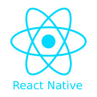

<h1 align="center">
Salut 👋, Je suis Vincent REMY
</h1>

## Bienvenue sur mon Github !

Je suis actuellement en étude chez Metz Numéric Scool, pour obtenir un mastère Expert en ingénierie informatique. Étant en alternance, je travaille aussi chez Chaussea en tant que développeur Full-Stack.
J'essaie d'apprendre un maximum de choses différentes et de m'améliorer sans cesse sur les points déjà acquis.
J'aime les défis, l'originalité et les choses bien faites (peut-être un peu trop parfois) !

## Vous voulez en savoir plus sur moi ?

- 👋 On peut m'appeler Vincent REMY ou par mon psoeudo Virex22

- 👀 En ce moment je m'interesse aux machine learning

- 🌱 Actuellement, j'apprends le Machine Learning, en particulier les algorithmes d'apprentissage supervisé tels que la régression linéaire et la classification. J'explore également les systèmes de pondération et les itérations, ainsi que les techniques de tri pour obtenir la meilleure stratégie dans la résolution de problèmes donnés. Mon objectif est de développer mes compétences en Machine Learning et de les appliquer dans des projets concrets.

- 👨‍🏫 Je propose des cours de C++ (moins maintenant avec le temps que je dispose)

- 📫 Contactez-moi sur :

## souhaitez-vous voir les technos que j'ai déjà utilisées ?
 
### Technos que j'ai le plus utilisées :

  
  
  
  
  
  
  

### Technos que j'ai moyennement utilisées :

  
  
  
  
  
  
  
  

### Technos que j'ai très peu utilisées (ou utilisées il y a très longtemps) :

  
  
  
  

### Mes autres outils :

  
  
  

## Mes statistiques :

  
📊 Mes statistiques Github

   
  

  
🌐 Mes statistiques d'utilisation de langage

   
  

  
🏆 Mes Trophées

     
    

<h2 align="center"> Merci d'avoir pris le temps de lire mon profil ! </h2>
