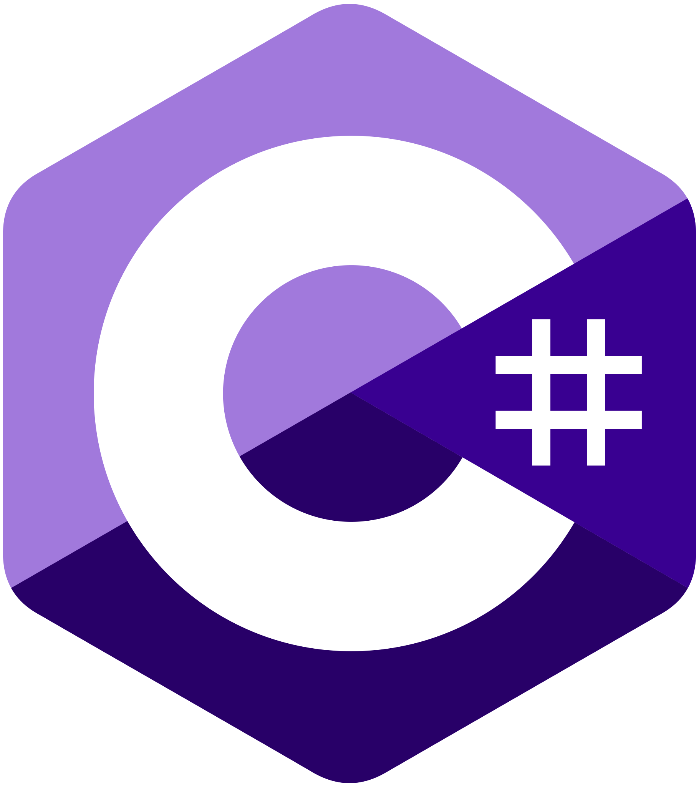

<h1 align="center">
Salut 👋, Je suis Vincent REMY
</h1>

## Bienvenue sur mon Github !

Je suis actuellement en étude chez Metz Numéric Scool, pour obtenir un mastère Expert en ingénierie informatique. Étant en alternance, je travaille aussi chez Chaussea en tant que développeur Full-Stack.
J'essaie d'apprendre un maximum de choses différentes et de m'améliorer sans cesse sur les points déjà acquis.
J'aime les défis, l'originalité et les choses bien faites !

## Vous voulez en savoir plus sur moi ?

- 👋 On peut m'appeler Vincent REMY ou par mon pseudo Virex22
- 💼 En alternance chez Chaussea en tant que développeur Full-Stack
- 🌐 vous pouvez visiter [ici](https://vincent-remy.fr) mon portfolio
- 👀 En ce moment je m'intéresse aux architectures logicielles et au Domain Driven Design
- 🌱 J'apprends aussi les algorithmes d'apprentissage par selection naturelle
- 💬 Demandez-moi n'importe quoi sur le développement, je suis toujours prêt à aider !
- 📫 Contactez-moi sur :

- Discord personnel : Virex22

## Principal technologies

### Développement Web

  
  
  
  
  
  
  

### Développement Logiciel

  
  
  
  

### Développement Mobile

  
  

### Autres Outils

  
  
  

## Mes statistiques

  
📊 Mes statistiques Github

   
  

  
🌠Mes statistiques d'utilisation de langage

   
  

  
🆠Mes Trophées

     
    

## Mes objectifs

- Participer à de gros projets dans de grosses boites industrielles ou non pour voir comment elles gèrent leurs projets etc...
- Dans le plus long terme, hybrider avec du freelance.

## Mes centres d'intérêt

- Lire des livres tech ou sur du développement personnel
- La finance et le trading

## Mes futurs projets

- Approfondir le Domain Driven Design
- coupler encore plus le développement et la finance pour améliorer mes compétences dans les deux domaines

## Pour me contacter ?

- Vous pouvez me contacter sur le [formulaire de contact de mon portfolio](https://vincent-remy.fr/contact)

<h1 align="center">
 A bientôt ! 👋
</h1>

PS : Le projet ML-Trade est accessible sur demande, envoyer un message discord si vous êtes intéressé.